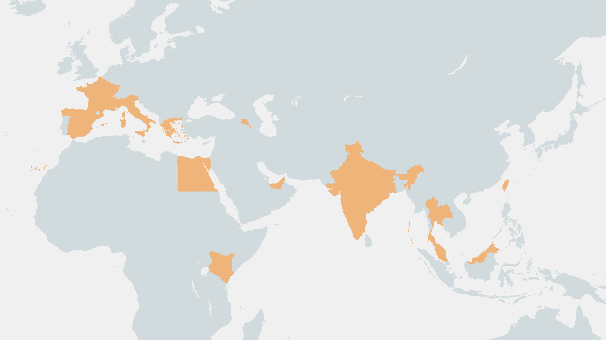

<!--
**robert6217/robert6217** is a ✨ _special_ ✨ repository because its `README.md` (this file) appears on your GitHub profile.
-->

[](https://www.youtube.com/watch?v=SDkAGkd4NLc) 

<p>
  <h1 align="center"><b>Hello there, I'm Robert Chang </b></h1>
</p>

<a href="https://git.io/typing-svg"></a>

<p align="left">  </p> 

I'm an **Embedded Software Engineer** from TPE, TW. That happens to takes photographs and is pationate about it, travel as well.

Feeling stuck in an infinite loop of routine, I've decided to **refactor my life**. Starting **March 2026**, I'm deploying myself to the world—heading West from Taiwan, hiking the **Camino de Santiago**, and walking until I hit the "End of the World".

**About me**
- 🔭 I'm currently working on **I’m currently working on my Great Backpacking Journey!**
- 🌱 I'm currently learning **I’m currently learning Frontend framework.**
- 👯 I'm looking to collaborate on **I’m looking to collaborate with other Developers or Traveler😉.**
- 💬 Ask me about **Ask me about anything, I am happy to help.**
- ⚡ Fun fact: **2026 is when I release the Major Update of my life.**
- 📝 Resume: 


👇 **Follow the deployment logs (Daily Reels):**<br>
<p align="left">
	<a href="https://instagram.com/_robertcc" target="blank"></a>
	<a href="https://youtube.com/@robertcc6217" target="blank"></a>
	<a href="https://github.com/robert6217" target="blank"></a>
	<a href="https://linkedin.com/in/robert-cc" target="blank"></a>
	<a href="https://leetcode.com/robert6217" target="blank"></a>
</p>

------------
<br>


```C
#include <stdio.h>

int main () {
	int age = 29;

	// Before 30: Stuck in the loop
	while(age < 30) {
		keep_coding(); 
	}

	// At 30: Break the loop & Start the journey
	traveling();

	return 0;
}
```

### 🌏 2026 The Great Backpacking Journey
*Last Updated: Automated by Python*



------------
<br>

**Skill & Tools I enjoy using**
<p align="center">
	<b>Languages<b/> <br />
	 <br /> <br />
	<b> Web<b/>  <br />
	 <br /> <br />
	<b> Other needed tools <b/>  <br />
	 <br /> <br />
	<b> Creative<b/>  <br />
	 <br /> <br />
</p>

## 📫 GitHub Stats
<p align="center">
<a href="https://github.com/robert6217">
	
</a>
<a href="https://github.com/robert6217">
	
</a>
</p>

